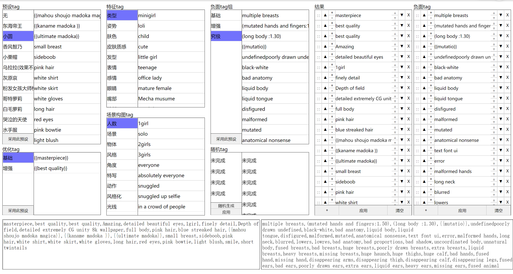
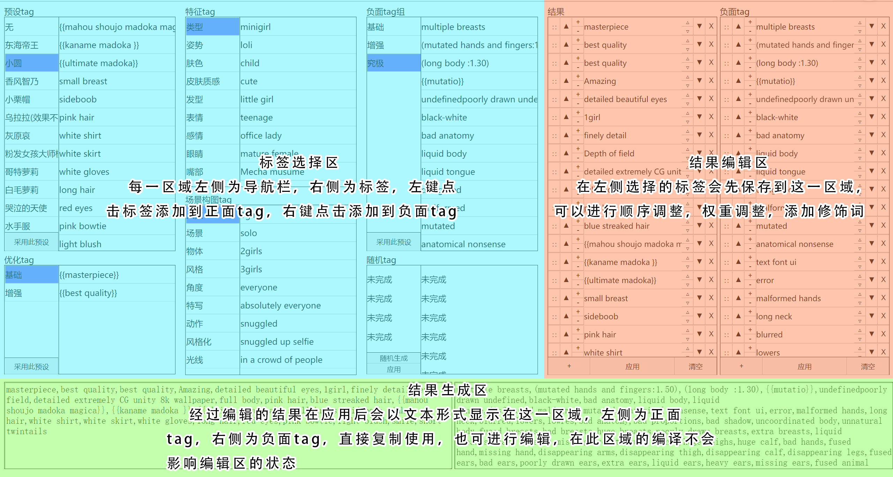
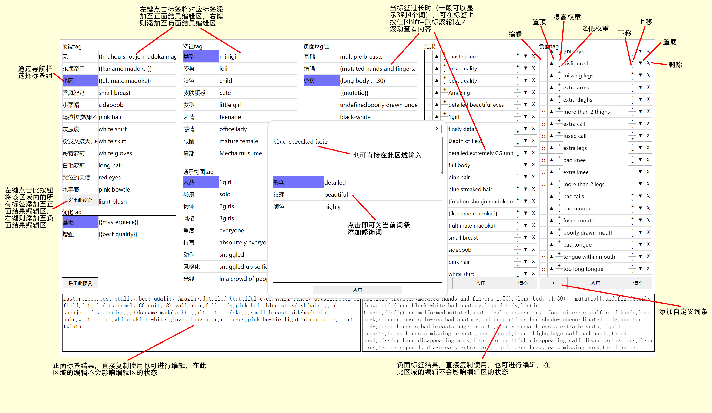
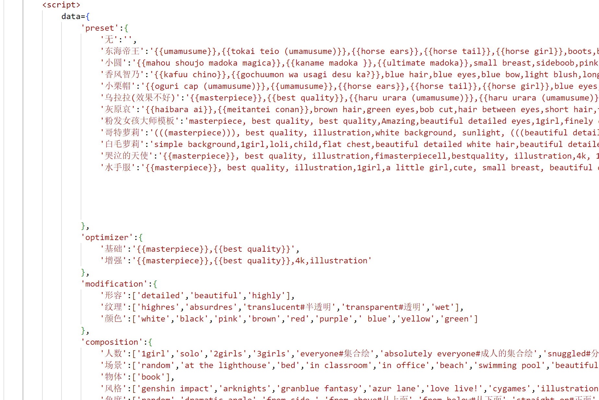
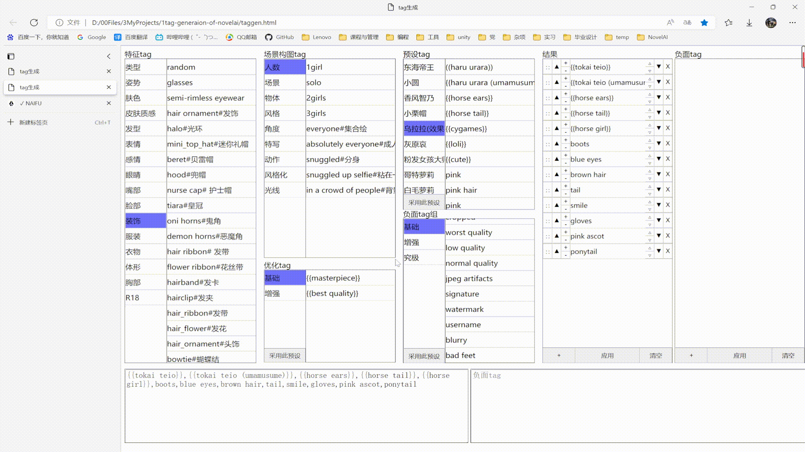
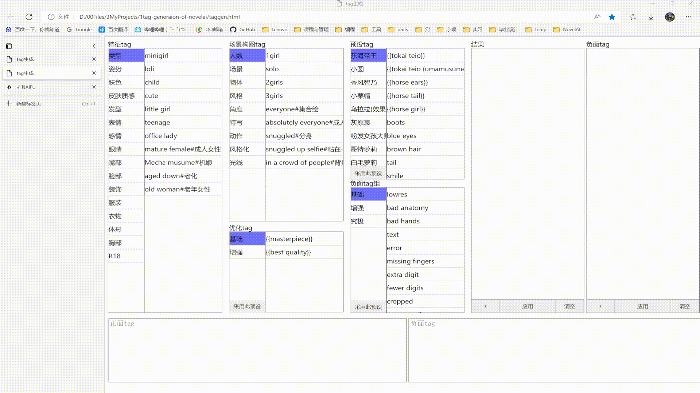
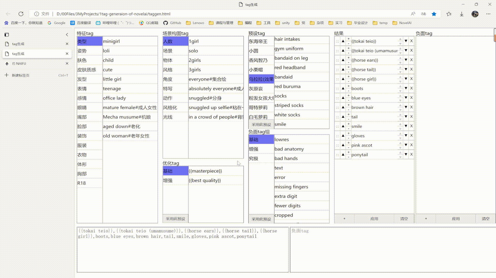

# tag-generaion-of-novelai
一个基于html的tag生成界面：

## 用法
* 下载taggen.html，用浏览器打开即可使用
* 了解页面用法：

* 添加数据：没有做保存tag组的功能，添加数据请在taggen.html中的data区域按json格式添加

## 技巧
* 按ctrl+F使用浏览器自带的搜索工具进行搜索

* 可以一次添加多个自定义词条

* 可以使用浏览器的翻译功能进行翻译

## 说明
* 本项目中的预设tag组均为自己手调，使用平台为秋葉aaaki整合的NAIFU版本
* 请勿将本项目用于商业用途